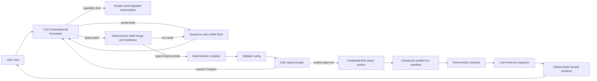

# Agentic Topology Optimization

A learning project that turns a plain-English structural design request into a
validated topology-optimization run—and then explains the result without allowing
an LLM to invent numerical facts.

The project combines:

- **The OpenAI Responses API plus CrewAI** for the places where language judgment
  helps: live conversational formulation and constrained organization of result
  evidence. The earlier one-shot CrewAI interpreter remains only for regression
  checks and lower-level compatibility.
- **Typed deterministic Python** for defaults, workflow transitions, validation,
  execution authority, and factual rendering.
- **FEniTop/FEniCSx** for finite-element analysis and topology optimization.
- **Streamlit** for a small chat interface and inspectable workflow trace.

This is a personal demonstration and learning repository, not a production or
multi-user engineering service. “Learning project” does not mean an intentionally
simplified toy: within its recorded scope, the goal is a dependable, well-tested
tool, and the engineering lessons from making it work are recorded in
[`LEARNING.md`](LEARNING.md).

It is a modified derivative of
[FEniTop](https://github.com/missionlab/fenitop) by Yingqi Jia, Chao Wang, and
Xiaojia Shelly Zhang. This repository is distributed under GPL-3.0; see
[`LICENSE`](LICENSE), [`NOTICE.md`](NOTICE.md), and
[`CITATION.cff`](CITATION.cff).

## What the demo does

In the web UI, a user describes a supported 2D structural problem in ordinary
language. The workflow then:

1. develops the structural problem conversationally while retaining a visible
   typed draft;
2. asks focused questions when physics is missing, conflicting, or unsupported;
3. applies and discloses deterministic numerical defaults;
4. validates physics, geometry, mesh entities, and estimated resource use;
5. shows the exact validated proposal and waits for explicit user approval;
6. runs the FEniCSx solver in an isolated child process;
7. verifies and analyzes the resulting manifest and artifacts; and
8. presents a fact-preserving explanation with inspectable evidence.

Unsupported requests stop before compilation or execution. A valid request also
stops before execution: the user must reply with an unambiguous green light such
as `yes`. A rejection keeps the proposal stopped, while requested changes are
reinterpreted, revalidated, and presented for fresh approval.

## Architecture: judgment at the edges, authority in the middle



The key design decision is that this is not a chain of autonomous agents calling
expensive tools. The LLM never chooses output paths, PETSc settings, resource
ceilings, run IDs, timeouts, or retry policy. It also never copies the normalized
configuration or run manifest between stages.

The workflow passes exact Pydantic objects through deterministic state machines:

```text
formulate ↔ gather/repair/reformulate → finalize typed problem and BC state
          → compile → validate → await approval → run → analyze → explain
```

This split makes the useful flexibility of language models visible while keeping
numerical and side-effect authority testable.

### Brain, hands, and interface

- `agentic/` is the **brain boundary**. It contains typed intent models, the
  Responses-backed conversation adapter, application-owned formulation draft,
  legacy CrewAI interpreter, deterministic compiler/orchestrator, and constrained
  evidence explainer.
- `fenitop/` is the **hands**. It knows nothing about CrewAI and exposes three
  framework-independent operations: `validate_config`, `run_topopt`, and
  `analyze_results`.
- `streamlit_app.py` is a **thin interface**. It retains typed workflow/job state,
  renders public events and evidence, and does not become workflow authority.

### Language-model roles are constrained

The live formulator returns a small schema-validated patch on each turn. It may
interpret ordinary language, notice conflicts, propose visible assumptions, and
ask focused questions. Deterministic code validates provenance and values, owns
the canonical draft, and alone decides whether it can cross the typed
finalization boundary.

The retained v1 interpreter returns exactly one schema-validated outcome:

- `ready`
- `needs_clarification`
- `unsupported`

It cannot call tools or invent missing problem-defining physics. Optional numerical
preferences may be omitted because the deterministic compiler supplies versioned
defaults. For mesh resolution, it targets an element size of
`sqrt(domain area) / 50`: a square becomes approximately `50 × 50`, while a
rectangle remains near 2,500 cells with nearly square elements. The default filter
radius is 1.5 times the larger element edge.

Strict output validates structure, but it does not prove where a value came from.
The interpreter therefore applies a deterministic provenance guard after model
output: mesh divisions, cell type, filter radius, and iteration limit are retained
only when the request explicitly mentions that preference. Otherwise they are
reset to `None`, selected by the compiler, and disclosed as defaults.

Relative boundary phrases are also kept semantic. For example, “the centered 10%
of the right edge” is represented as `edge=right`, `center_fraction=0.5`, and
`span_fraction=0.1`; deterministic compilation converts those fractions using the
domain bounds. The model does not perform the coordinate arithmetic.

The result explainer is not a free-form report writer. Deterministic analysis
creates immutable fact IDs; the LLM may only organize allowed IDs under allowed
headings. Code then checks completeness and renders the original fact text. An
unknown, duplicated, or omitted required fact makes the explanation fail closed.

### Conversational formulation is the live UI path

The Streamlit UI now uses the provider-independent core and live Responses
adapter so ordinary problem descriptions can be developed over several turns
without weakening the solver boundary:

- `ProblemDraft` retains partial facts, their source turn, a short modeling
  rationale, and whether each fact was explicit, derived, assumed, or confirmed.
- Formulation-only facts retain width, height, origin, relative support edges, and
  long/short-side mesh preferences before enough geometry exists to map them into
  solver coordinates.
- A small `FormulationTurn` contains a natural assistant message, changed fields,
  up to three questions, and a conversation-state hint.
- Deterministic code validates each changed field, rejects unsupported provenance,
  records corrections, gives rejected patches back to the model for one bounded
  repair attempt, identifies missing or unconfirmed facts, and alone decides
  whether the draft is ready.
- Assumptions remain visible and cannot cross typed finalization until the user
  confirms them.
- The finalized draft enters a deterministic compiler that validates ordinary
  problem facts separately from complete, confirmed first-class BC entities,
  then reuses the existing validation and approval path.
- `OpenAIResponsesFormulationAgent` uses strict Pydantic output, medium reasoning,
  `previous_response_id`, and persisted all-turn reasoning. The canonical draft
  is included on every call, and an expired continuation triggers exactly one
  full-history recovery; generic provider retries remain disabled.
- The strict API transport is 6,787 characters versus 235,234 for the v1 one-shot
  schema. Ordinary and boundary field values travel as compact JSON strings and
  are decoded immediately through existing deterministic validators. Flat
  create/update/delete/confirm BC operations avoid exposing the recursive solver
  schema.
- Streamlit stores the typed `FormulationSession` across reruns and shows accepted
  facts, fact basis, missing information, assumptions, capability limits, and
  deterministic conflicts. Exact provenance and revision history remain available
  in an inspectable expander.
- A ready formulation enters the orchestrator only through
  `prepare_formulation()`. A requested change immediately invalidates the older
  proposal before the new model call, so a failed revision cannot leave stale
  parameters approvable.

The versioned six-scenario billed evaluation covers disordered input, correction,
unsupported-load negotiation, 3D reformulation, conflicting geometry, and casual
mesh preferences. Sol/medium and Terra/medium both pass all six; Sol/medium is the
quality-first default while Terra/medium is a measured lower-latency option.
Responses are stored to support continuation under OpenAI's default response
retention; the application draft remains the durable source of truth.

After the first-class BC adapter migration, the v3 Sol/medium gate again passes
all six with zero solver starts. Its ten calls recorded 51,726 input, 7,921
output, and 3,578 reasoning tokens in 147.888 seconds. The earlier v2
Sol/Terra comparison remains the model-selection evidence; v3 specifically
verifies the richer live BC transport.

### Execution boundary

Streamlit, CrewAI, Dolfinx, and the solver share one pinned Docker image for a
simple demo setup. Each native solve still runs in a separate child process:

- the parent owns run paths, limits, idempotency, timeout, and cancellation;
- all `OPENAI_*` variables are removed from the worker environment;
- lifecycle, timeout, cancellation, and worker failures become typed outcomes; and
- successful artifacts are described by a checksum-verified `RunManifest`.

There are two duplicate-solve defenses: an in-process orchestrator cache and a
stable durable idempotency key derived from the conversation, compiled config, and
defaults profile. Streamlit reruns therefore do not own or repeat solver work.

## Quick start: run the chat demo

### Prerequisites

- Docker Engine with Docker Compose
- an OpenAI Platform API key with API billing or prepaid credit enabled

A ChatGPT subscription does not include OpenAI API credit. CrewAI is installed
inside the project image; nothing is installed globally on the Mac.

### 1. Configure the local environment

```bash
cp .env.example .env
```

Set your key in the untracked file:

```dotenv
OPENAI_API_KEY=your-real-api-key
OPENAI_MODEL=gpt-5.6-terra
OPENAI_FORMULATION_MODEL=gpt-5.6-sol
OPENAI_FORMULATION_REASONING_EFFORT=medium
```

`.gitignore` excludes `.env` and `.env.*` while allowing `.env.example`.
`.dockerignore` also excludes local environment files, preventing the key from
being copied into an image layer. Compose injects the key only into the parent
application container.

### 2. Build the pinned image

```bash
docker compose build
```

The image installs the exact closure in `requirements/runtime.lock`, including
CrewAI `1.15.6`, Pydantic `2.12.5`, and Streamlit `1.60.0`.

### 3. Start the UI

```bash
docker compose up ui
```

Open <http://localhost:8501>. Stop the foreground service with `Ctrl-C`; if it was
started with `-d`, use:

```bash
docker compose stop ui
```

## Reproducible demo conversations

These prompts exercise formulation, approval, and capability behavior. Model
wording may vary, but typed draft state and side-effect behavior are authoritative.
For broader user-led testing, including five realistic reviewed scenarios, a
coverage matrix, mesh-customization variants, and capability-limit probes, see
[`docs/acceptance-scenarios.md`](docs/acceptance-scenarios.md).

### 1. Ready request with visible defaults

```text
Minimize compliance of a rectangular 10 by 4 mm plane-strain domain starting at
[0, 0]. Use Young's modulus 100 MPa and Poisson ratio 0.3, with mm, N, and MPa
as the mechanical unit system. Fully clamp the entire left edge and apply a
distributed traction [0, -1] MPa on the entire right edge. Use 40 percent
material.
```

Expected behavior:

- formulation status becomes `ready_for_review`, followed by workflow status
  `awaiting_run_approval`;
- no clarification is required;
- the UI explicitly says mesh, filter, iteration, and other numerical settings
  were not provided and were selected by the compiler;
- the derived mesh is approximately `79 × 32`, giving near-square cells and about
  2,500 elements;
- validation succeeds and the UI asks whether the user approves the displayed
  parameters;
- no solver process starts until the user replies `yes`; and
- the final response cites deterministic convergence, metric, constraint, and
  quality evidence.

The traction vector is distributed force per boundary length per unit thickness,
not a total force.

### 2. Missing physics requires clarification

```text
Optimize a 10 by 4 beam. Fix the left side, put a load on the right, and use
40 percent material.
```

Expected behavior:

- formulation status remains `gathering`;
- no config is compiled and no solver starts;
- the assistant asks for details such as material properties, precise load
  magnitude/direction, and any ambiguous problem definition; and
- the visible typed draft and provider continuation are both retained, while the
  application draft remains authoritative.

### 3. Unsupported request stops safely

```text
Optimize a three-dimensional cantilever with a roller support and a prescribed
nonzero displacement.
```

Expected behavior:

- the UI identifies each capability mismatch and may offer a supported
  reformulation;
- status is `unsupported` when the problem cannot usefully continue, or
  `gathering` while a supported reformulation is being negotiated; and
- validation and solver execution are never called.

### 4. Component support and true pin

```text
Minimize compliance of a rectangular 10 by 4 mm plane-strain domain starting at
[0, 0]. Use Young's modulus 100 MPa and Poisson ratio 0.3, with mm, N, and MPa
as the mechanical unit system. Put a normal roller along the entire bottom edge
and a pin at the midpoint of the left edge, [0, 2]. Apply a distributed traction
[0, -1] MPa on the entire right edge. Use 40 percent material.
```

Expected behavior:

- the bottom roller becomes zero `y` displacement, not a full clamp;
- the pin becomes zero `x` and `y` displacement at one boundary mesh node, not a
  clamped edge segment;
- the validated cards and preview show the requested and resolved pin point plus
  any mesh snap distance;
- the component-aware rigid-body check succeeds and the proposal waits for the
  same explicit run approval as every other valid problem; and
- placing the pin at a bottom-edge node instead would be rejected because its
  zero-`y` degree of freedom would duplicate the roller constraint. Move the pin
  away from the roller edge or change the support arrangement rather than asking
  the model to hide the duplicate.

## No-credit deterministic harness

To exercise compile → validate → contained solve → manifest handoff → analysis
without making an API call:

```bash
docker compose run --rm -T fenitop \
  python scripts/stage1_workflow_harness.py
```

The canned request uses an `8 × 4` mesh and five iterations. The harness performs
an explicit developer-owned approval transition before execution. Run it twice:
the second invocation should report the same run ID and
`idempotent_replay=true`.

## Model checks

The basic structured-output smoke test makes one real billed API call:

```bash
docker compose run --rm -T fenitop \
  python scripts/stage0_model_smoke.py
```

Expected shape:

```text
crewai_structured_output=ok model=gpt-5.6-terra status=ok answer=4
```

The occasional golden classification check compares supported, ambiguous, and
unsupported scenarios:

```bash
docker compose run --rm -T fenitop \
  python scripts/stage0_golden_intents.py
```

It calls real models and incurs API cost, so it is deliberately excluded from the
default test suite.

The post-v1 live formulation evaluation makes multiple billed Responses API calls,
never starts a solver, and compile/mesh-validates every scenario that reaches
review:

```bash
docker compose run --rm -T fenitop \
  python scripts/formulation_live_eval.py \
  --models gpt-5.6-sol gpt-5.6-terra \
  --reasoning-effort medium \
  --summary-only
```

Use `--scenarios <id> ...` to run a focused subset. The fixture and deterministic
graders live under `tests/fixtures` and `scripts/formulation_live_eval.py`.

The boundary-condition redesign also has a no-credit, provider-independent
53-case semantic corpus. It includes the supplied multi-turn failure, the two
previously failing complete prompts, partial and corrected BCs, resultants,
pressure, unit ambiguity, and unsupported support/load semantics:

```bash
docker compose run --rm -T fenitop \
  pytest -q tests/agentic/test_bc_evaluation.py
```

Its complete billed release evaluator calls only the live formulation adapter,
never the orchestrator or solver. It retries connection, timeout, and provider
internal-server failures up to three times but never retries a semantic failure:

```bash
docker compose run --rm -T fenitop \
  python scripts/boundary_live_eval.py --summary-only
```

Use `--scenarios <id> ...` for focused diagnosis. The current corpus contract is
`boundary-condition-evals-v7`; the command incurs API cost.

The provider-independent Package 1 core stores partial BC entities with
stable application-owned IDs, field-level provenance, revisions, pending
confirmations, and typed create/update/delete/confirm patches.

The Package 2 core adds provenance-bearing `units.length`, `units.force`, and
`units.stress` draft facts plus Docker-pinned dimensional normalization. It
retains the original display value/unit, resolves global and edge-local load
directions, converts pressure and traction magnitudes to global traction vectors,
and keeps total resultants as forces. A resultant is explicitly marked deferred:
it cannot become a traction until the Package 3 mesh resolver supplies the actual
loaded-boundary measure.

Package 3 upgrades the prepared tool boundary to canonical
`AgentSafeConfig 2.0` and tool contract `5.0.0`. Stable `S…`/`L…` boundary
conditions now carry expert-region or rectangle-edge selectors and distinguish
uniform effective traction from uniform total resultant. One shared mesh resolver
is used by both validation and FEM execution; its evidence includes requested and
resolved extents, facet count, measure, centroid, normal, resolution error, and
load conversion. Legacy 1.1 inputs are still accepted through deterministic
migration, while successful validation returns canonical 2.0.

Package 4 makes complete, confirmed first-class BC entities authoritative at the
formulation/compiler boundary. It deterministically converts fraction,
coordinate, physical-width, and corner-offset selectors; normalizes explicit-unit
tractions or preserves total resultants; and keeps stable `S…`/`L…` IDs in schema
2.0. Legacy live conversations cross through one explicit migration at this
boundary. Approval now fails closed without successful mesh evidence and shows
requested selectors beside resolved facets, extents, measures, normals, load
conversions, integrated resultants, units, thickness, and warnings. The separate
user green-light transition is unchanged.

Package 5 moves the live Responses prompt and adapter onto that first-class path.
The model now creates partial BC entities through turn-local references, updates
or confirms existing stable IDs, distinguishes pressure/traction/resultant/point
semantics, preserves semantic selectors without arithmetic, asks for missing
units, and records unsupported rollers/pins/point loads without aliasing them.
The application still owns IDs, migration of older browser-session facts,
provenance validation, readiness, unit/geometry conversion, approval, and every
side effect.

Package 6 makes that state reviewable at the user's level. Partial and validated
supports/loads appear as human-readable cards keyed by their stable `S…`/`L…`
labels, with direct correction guidance such as “Change L1 …”. Before approval,
the UI draws a deterministic rectangle diagram from successful validation
evidence: orange dashed spans show the requested continuous extent, solid spans
show the mesh-resolved support/load facets, and load arrows use the resolved
global traction direction. Cards show facet count, resolved extent and measure,
effective traction, integrated resultant, units, thickness, and warnings where
applicable. Exact field provenance and revisions remain in the diagnostic
expander; neither the cards nor the diagram perform geometry resolution or grant
run authority.

Package 7 adds the fixed 53-conversation live gate and the deterministic
normalization needed to grade engineering meaning rather than model spelling.
Equivalent fractional selector forms compare as the same interval, exact points
may carry a redundant consistent corner label, and constant traction over a
complete finite selector is deterministically uniform. Unsupported semantics,
assumptions, clarifications, silent conversions, and the no-solver rule remain
exactly graded. The complete local gate passes. The final clean live run passed
all 53 conversations on Sol/medium with zero solver starts, zero context
recoveries, and no transport retries. Application-owned state now retains a named
edge center even while load kind/extent are unresolved and prevents an identical
later assumption from weakening that derived fact.

Package 8 versions component support as `AgentSafeConfig 2.1`, tool contract
`5.1.0`, and `formulation-system-v4` / `openai-responses-v4`. Zero-displacement
components are explicit solver facts: normal rollers and symmetry constrain the
edge-normal component, while a true pin constrains both components at one
boundary mesh node. Validation shows requested/resolved pin points and snap
distance, calculates rigid-body rank from actual constrained components, rejects
duplicate constrained DOFs and wholly ineffective loads, and preserves valid 2.0
inputs through deterministic migration. The UI shows component support cards and
pin nodes in the validated preview. A real Dolfinx roller+pin baseline passes,
and the complete v7 live gate is 53/53 with zero solver starts.

The acceptance-repair v5 formulation contract extends the same application-owned
entity state to mechanism springs. Input and output springs receive stable `I…`
and `O…` identities, retain partial semantic edge selectors and per-field
provenance, and carry an explicit force-per-length stiffness unit. Deterministic
compilation converts fractional/physical selectors to the bounded region DSL and
normalizes values such as `N/m` into the configured `N/mm` context. Approval shows
the original and normalized stiffness, active direction, and matched directional
nodal DOF count. Named pin corners are likewise retained semantically and resolved
from the confirmed rectangle bounds. Deterministic readiness supplies a
human-readable fallback question whenever a model turn omits one.

Validation warnings now appear in the approval request and flow into final
evidence. Compliance results name compliance as the objective instead of showing
the mechanism-only zero objective field. The OC updater keeps its non-descent
safeguard but clips only scale-insignificant positive sensitivity noise; the
previously failing mixed-load beta transition now completes normally.

## Supported natural-language scope

The natural-language workflow supports:

- rectangular 2D domains;
- isotropic linear elasticity in plane strain with unit thickness;
- compliance minimization and compliant-mechanism optimization;
- one consistent user unit system;
- full-vector zero clamps, zero-component rollers/symmetry boundaries, and true
  boundary-node pins;
- constant distributed boundary tractions, pressure, uniform total resultants,
  and constant body force;
- a volume-fraction constraint;
- quadrilateral or triangular meshes;
- declarative `plane`, `range`, `circle`, `all`, `none`, `and`, `or`, and `not`
  regions; and
- compliant-mechanism input/output springs with stable identities, semantic edge
  selectors or expert regions, explicit direction, dimensioned stiffness, and
  positive per-matched-directional-DOF application.

## Known limitations

This demo intentionally does not support:

- 3D or non-rectangular geometry in the agent-safe workflow;
- plane stress, nonlinear, dynamic, thermal, or multi-material physics;
- nonzero prescribed displacement;
- mathematical point loads;
- user-provided code/lambdas in serialized regions;
- parallel/MPI execution through `run_topopt`;
- multiple simultaneous solves; or
- browser-provided paths, solver profiles, rendering controls, limits, or safety
  overrides.

The repository still includes legacy 2D/3D example scripts, but those are not part
of the natural-language contract. Mechanism spring stiffness is
mesh/region dependent because it is applied per matched directional nodal degree
of freedom. Artifact SHA-256 checks provide local integrity, not authenticity
against someone able to rewrite the trusted results root. The child process
contains native crashes but shares the container's memory boundary.

For a live presentation, the workflow still depends on API/network availability;
the deterministic harness is the current offline fallback, not a prerecorded UI
demo.

## Outputs and evidence

Each run is placed under an application-owned directory in `results/` and includes:

- density and displacement XDMF histories with HDF5 sidecars;
- a flushed iteration log;
- a final JSON summary;
- atomic lifecycle state;
- a canonical run manifest with relative artifact paths, sizes, and SHA-256; and
- deterministic analysis plots/evidence when generated.

Open XDMF files in ParaView. Density and displacement use separate time series so
each file exposes a clean field while retaining all recorded iterations.

After a successful run, the UI shows a downloadable result gallery containing the
final density design, compliance objective history, volume history, and
design-change history. Compliant-mechanism runs additionally show their signed
output-objective history.

The Streamlit “Inspectable workflow trace” shows public stage events, the compiled
agent-safe configuration, validation/resource evidence, and deterministic analysis
evidence. It deliberately does not expose private chain-of-thought.

## Run the tests

Build the image, check the locked dependency environment, and run the complete
checkpoint suite:

```bash
docker compose build
docker compose run --rm -T fenitop python -m pip check
docker compose run --rm -T fenitop pytest -q
```

Current checkpoint: **311 tests plus 197 subtests pass**. The suite
includes schema and adversarial-input tests, real compliance/mechanism baselines,
finite-difference sensitivities, geometry validation, resource calibration,
process timeout/cancellation/crash behavior, secret scrubbing, path and
idempotency cases, manifest integrity, CLI/MCP composition, mocked LLM workflow
branches, conversational repair/continuation behavior, semantic partial-draft
resolution, formulation-to-orchestrator handoff, stale-approval invalidation,
visible assumption/capability/error states, fact-preserving explanation checks,
and Streamlit application tests.

The focused test tiers and exact tool contracts are documented in
[`docs/tool-reference.md`](docs/tool-reference.md).

Before a release checkpoint, also verify the local secret boundary and Compose
configuration:

```bash
git check-ignore -q .env
! git ls-files --error-unmatch .env
docker compose config --quiet
```

The first command proves the real key file is ignored; the second proves it is
not tracked. `.env.example` remains intentionally committed with a blank key.

## Direct tool and example usage

The three tools share the same typed implementation across direct Python,
JSON CLI, and stdio MCP transports. Start the MCP server with a clean non-TTY stdio
transport:

```bash
docker compose run --rm -T fenitop \
  python -m fenitop.tools.mcp_server
```

The repository also retains config-driven solver examples:

```bash
docker compose run --rm fenitop \
  python scripts/beam_2d.py --config config/beam_2d.json

docker compose run --rm fenitop \
  python scripts/mechanism_2d.py --config config/mechanism_2d.json
```

These example entry points are lower-level than the agentic workflow and write
their outputs beneath `results/`.

## What this project taught

- **Use an LLM for ambiguity, not authority.** Natural language requires judgment;
  solver paths, safety settings, numerical defaults, and side effects do not.
- **Structured output is a boundary, not a guarantee by itself.** Strict Pydantic
  models, semantic validation, bounded retries, and deterministic handoffs are
  still necessary.
- **Make defaults visible and approval explicit.** A user should know which values
  they supplied, which values the application selected, and be able to change
  either before any expensive solve starts.
- **A UI migration is a trust-boundary change.** Replacing a one-shot interpreter
  requires a typed formulation-to-orchestrator handoff and immediate invalidation
  of stale approval state when the user requests a change.
- **Structured shape is not provenance.** Nullable model fields still need a
  deterministic check that an optional value was actually requested.
- **Idempotency belongs below the UI.** Rerun-prone interfaces should display job
  state, while application/tool layers own durable duplicate protection.
- **Contain native numerical work.** Python exceptions cannot reliably contain
  PETSc/MPI aborts or process-level memory failures.
- **Fact preservation needs structural enforcement.** Asking a model not to
  hallucinate is weaker than allowing it to return only evidence identifiers.
- **Pin and retest the whole environment.** Adding CrewAI required compatible
  Pydantic/Rich versions; adding Streamlit selected PyArrow `24.0.0` instead of
  `25.0.0`. Both changes were accepted only after rebuilding and rerunning the
  numerical suite.

## Repository map

```text
agentic/                  formulation, intent, compilation, orchestration, explanation
  prompts/                versioned LLM capability prompts
fenitop/                  FEM/topology-optimization domain library
  tools/                  validate, run, analyze, lifecycle, manifest, transports
streamlit_app.py          thin chat and workflow-trace UI
config/                   lower-level JSON example configurations
scripts/                  demos, smoke checks, and legacy examples
tests/                    agentic, transport, lifecycle, and numerical verification
  fixtures/               baselines, resource calibration, and artifact fixtures
docs/spec.md              living status and decision log
docs/tool-reference.md    exact tool contracts and developer reference
docs/acceptance-scenarios.md
                          realistic user acceptance prompts and coverage
LEARNING.md               chronological engineering lessons and failed approaches
NOTICE.md                 upstream authorship and modification notice
CITATION.cff              software and FEniTop paper citation metadata
LICENSE                   GPL-3.0 license text
results/                  generated, gitignored run artifacts
```

## Project records

- [`docs/spec.md`](docs/spec.md) is the living decision log and current-status
  handoff for future development sessions.
- [`docs/tool-reference.md`](docs/tool-reference.md) is the detailed tool
  contract, including fields, failure behavior, and focused verification commands.
- [`docs/acceptance-scenarios.md`](docs/acceptance-scenarios.md) contains the
  review-first user acceptance journeys, expected evidence, coverage matrix, and
  explicit gaps.
- [`LEARNING.md`](LEARNING.md) records what the project learned from preparing the
  solver as an agent-safe tool, building the orchestration, and repairing real
  failures.
- [`NOTICE.md`](NOTICE.md) records upstream authorship and this derivative's major
  changes.
