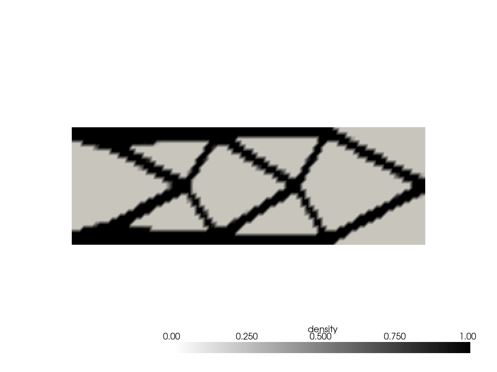
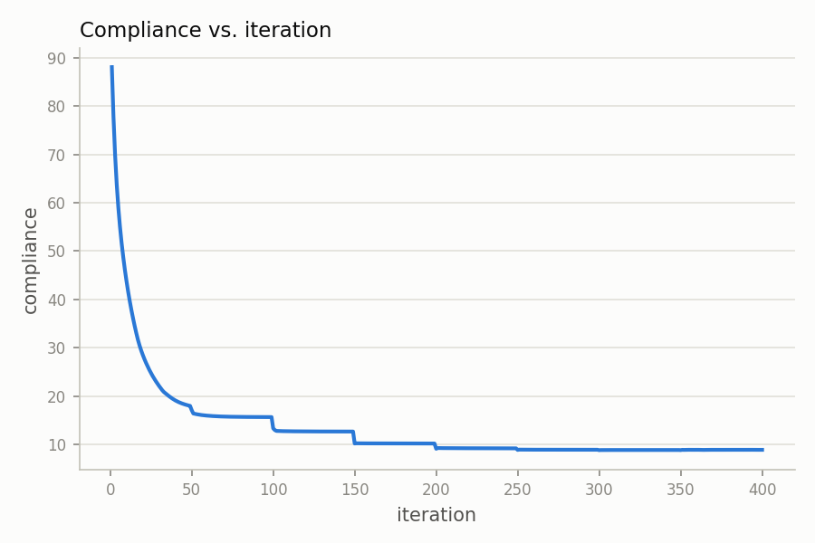
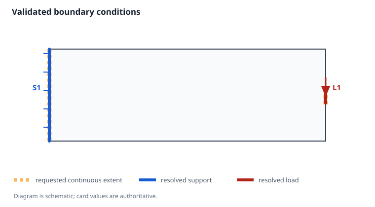
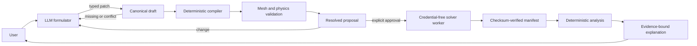
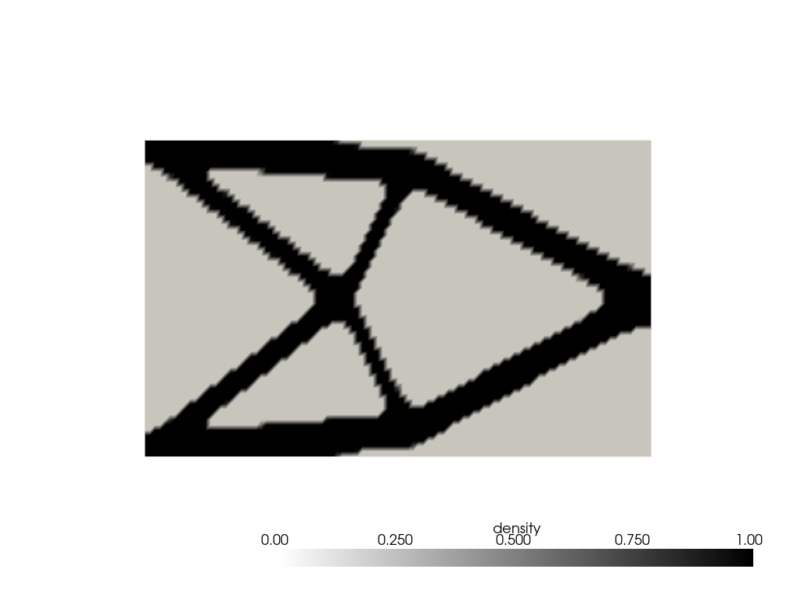

# Agentic Topology Optimization

**A conversational engineering workflow that turns design intent into a reviewed,
validated, and auditable topology-optimization run.**

Engineers describe problems in terms of walls, loads, pins, rollers, dimensions,
and material limits. Numerical solvers expect exact meshes, selectors, units, and
boundary conditions. This project bridges that gap without allowing a language
model to become the authority for physics or expensive execution.

The result is more than a chat interface around a solver. It is a human-in-the-loop
agentic system: the model helps formulate an incomplete problem over multiple
turns, deterministic code owns the canonical state and safety decisions, and the
user must approve the exact resolved problem before FEniCSx is allowed to run.

<table>
  <tr>
    <td></td>
    <td></td>
  </tr>
  <tr>
    <td align="center"><em>Final material layout</em></td>
    <td align="center"><em>Compliance reduced from about 88 to 8.89</em></td>
  </tr>
</table>

> Portfolio/demo software, not certified engineering design software. The
> numerical core is derived from
> [FEniTop](https://github.com/missionlab/fenitop); attribution and license details
> are in [NOTICE.md](NOTICE.md), [CITATION.cff](CITATION.cff), and
> [LICENSE](LICENSE).

## Why I built it

Topology optimization is powerful, but setting up a correct problem is difficult:

- the user's description is usually incomplete and arrives in a human order, not
  a schema order;
- boundary-condition language is varied and easy to misinterpret;
- a syntactically valid region may select zero mesh facets;
- unit conversion and total-force distribution depend on resolved geometry;
- an expensive numerical tool must not run because a model merely sounded
  confident; and
- a fluent final explanation must not invent results.

These are the same problems that make many real agentic applications hard:
uncertain language at the input, strict tools at the output, state accumulated
over time, costly side effects, and a need for evidence.

I built this project to learn how to solve those problems as a complete system.
The solver is useful; the larger result is a reusable approach to trustworthy
agentic workflows.

## What it does

A user can describe a supported rectangular 2D problem in ordinary language:

```text
I need a lightweight mounting arm in a 600 mm by 200 mm design space.
The whole left face is built into a wall. A downward traction of 1.5 MPa
acts on the middle 40 mm of the right edge. Use aluminium-like properties,
35% material, and choose reasonable numerical settings for me.
```

The application then:

1. builds a typed problem draft over one or more turns;
2. retains partial facts and assigns stable labels such as `S1` and `L1`;
3. asks focused questions for missing, conflicting, or unsupported physics;
4. shows every accepted fact, assumption, correction, and deterministic default;
5. resolves conditions against the real mesh and displays the resulting evidence;
6. presents the complete proposal and waits for an explicit user green light;
7. runs one contained FEniCSx optimization without model credentials;
8. verifies the output manifest and creates the result gallery; and
9. explains the result using only validated evidence.

Changing a parameter invalidates the previous approval. An ambiguous `continue`
does not start a solve. Unsupported requests remain conversations rather than
becoming malformed solver inputs.

The pre-run diagram is generated deterministically from the same validated
geometry evidence used by FEM assembly—not from an LLM sketch:



## Architecture



The architectural principle is **judgment at the language boundary, authority in
deterministic code**.

| Concern | Owner |
| --- | --- |
| Interpret informal language and ask useful questions | LLM formulator |
| Canonical state, provenance, revisions, and readiness | Typed application core |
| Defaults, units, geometry, mesh selectors, and resource limits | Deterministic compiler and validator |
| Permission to spend compute | Explicit user approval plus workflow state machine |
| Native PETSc/FEniCSx execution | Isolated child process |
| Result facts and artifact integrity | Manifest verification and deterministic analysis |
| Natural-language result structure | LLM constrained to known evidence IDs |

The LLM never chooses paths, run IDs, timeouts, PETSc options, resource ceilings,
or retry policy. It never sends an executable region function to the solver.

## Why this is an agentic workflow

The implementation demonstrates several patterns that transfer beyond numerical
engineering:

- **Multi-turn state:** the application, not the provider, owns a typed partial
  draft and field-level provenance.
- **Tool design:** validation, execution, and analysis are separate operations
  because they have different costs and trust levels.
- **Semantic intermediate representation:** phrases such as “centered 10% of the
  right edge” remain semantic until deterministic geometry code can resolve them.
- **Human approval:** readiness and approval are different states; only an
  unambiguous approval transition authorizes execution.
- **Fail-closed behavior:** invalid patches, unresolved assumptions, damaged
  evidence, and unknown explanation facts stop the workflow.
- **Idempotency:** durable request identity prevents a Streamlit rerun from
  launching the same expensive solve twice.
- **Evaluation-driven development:** fixed conversation corpora, deterministic
  tests, numerical baselines, and manual end-to-end scenarios test different
  layers.
- **Observable reasoning:** accepted facts, rejected changes, assumptions,
  boundary resolution, warnings, lifecycle events, and result evidence remain
  inspectable.

## Results and evidence

The current portfolio release has:

- **311 tests plus 197 parameterized subtests** passing in the pinned Docker
  environment;
- a **53/53 fixed boundary-language evaluation** on the released live formulation
  contract, with zero solver starts during language evaluation;
- real numerical baselines for clamps, total resultants, rollers, and point pins;
- five realistic end-to-end acceptance journeys covering casual language,
  corrections, defaults, customized meshes, pressures, resultants, multiple
  loads, and compliant mechanisms; and
- regression fixes derived from the first manual acceptance run rather than from
  isolated unit tests alone.

The gallery above is a real 600 mm × 200 mm cantilever run with 35% requested
material. It used an automatically selected near-square 87 × 29 quadrilateral
mesh. The optimization reached 8.894 compliance, 0.3479 final volume fraction,
and 0.9905 binarization score after completing its projection continuation. It
stopped at the configured iteration limit, so the repository reports
`converged=false` instead of overstating the result.

A second real run exercised a 20 N total resultant on a mesh-resolved boundary
patch and a near-incompressible plane-strain warning:



See [docs/project-story.md](docs/project-story.md) for the acceptance findings,
repairs, evaluation strategy, and the engineering lessons behind these numbers.
The reusable plain-language scenarios are in
[docs/acceptance-scenarios.md](docs/acceptance-scenarios.md).

## Technology

- **OpenAI Responses API** — multi-turn formulation with strict structured output
- **CrewAI** — retained one-shot interpreter and evidence-explainer integration
- **Pydantic** — versioned contracts and validation
- **FEniCSx / Dolfinx, PETSc, MPI** — finite-element and native numerical runtime
- **FEniTop** — topology-optimization foundation
- **Pint** — dimensional normalization with retained user-facing units
- **Streamlit** — conversational UI and inspectable workflow trace
- **Docker Compose** — reproducible pinned runtime and secret injection
- **pytest** — deterministic, contract, workflow, UI, and numerical regression tests

## Run it locally

### Requirements

- Docker Desktop with Compose
- an OpenAI API key with available credit

The scientific stack and CrewAI are installed inside Docker, not on the Mac.

```bash
git clone https://github.com/cdev911/AgenticTopologyOptimization.git
cd AgenticTopologyOptimization
cp .env.example .env
```

Add your key to `.env`:

```dotenv
OPENAI_API_KEY=your_key_here
```

Then build and launch:

```bash
docker compose build fenitop
docker compose up streamlit
```

Open [http://localhost:8501](http://localhost:8501), submit one of the
[acceptance scenarios](docs/acceptance-scenarios.md), review the resolved proposal,
and approve only when it matches your intent.

Stop the application with:

```bash
docker compose down
```

The `.env` file, raw results, and user-owned acceptance transcripts are ignored
by Git.

### Verify without paid model calls

```bash
docker compose run --rm -T fenitop python -m pip check
docker compose run --rm -T fenitop pytest -q
```

The normal test suite uses canned model responses. Live model evaluations are
separate, explicit, billed commands and are not required to inspect the project.

## Repository guide

| Path | Purpose |
| --- | --- |
| `streamlit_app.py` | Thin conversational interface |
| `agentic/` | Formulation state, provider adapter, compiler, approval workflow, and explanation |
| `fenitop/tools/` | Agent-safe validation, execution, and analysis contracts |
| `fenitop/` | Numerical topology-optimization implementation |
| `tests/` | Contract, safety, workflow, UI, and numerical regressions |
| `docs/tool-reference.md` | Exact supported physics and tool behavior |
| `docs/project-story.md` | Case study, failures, design decisions, and portfolio evidence |
| `LEARNING.md` | Transferable lessons from building the workflow |

## Supported scope

The agent-safe contract supports rectangular 2D plane strain, isotropic
single-material compliance and compliant-mechanism optimization, full clamps,
component rollers/symmetry supports, true boundary-node pins, distributed
traction, pressure, uniform total resultants, body force, and mechanism springs.

It intentionally does not claim support for 3D, non-rectangular domains, plane
stress, nonlinear/dynamic/thermal physics, multiple materials, mathematical
point loads, varying tractions, nonzero prescribed displacements, or applied
moments. The conversation may recognize these requests and explain the boundary,
but it must not silently approximate them.

## Project status

This repository is a finished portfolio release of the implemented scope. Future
physics extensions are deliberately outside the current showcase; the detailed
development snapshot is preserved on the
`archive/development-record-2026-07-27` branch.
