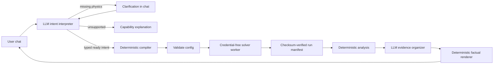

# Agentic Topology Optimization

A learning project that turns a plain-English structural design request into a
validated topology-optimization run—and then explains the result without allowing
an LLM to invent numerical facts.

The project combines:

- **CrewAI + an OpenAI model** for the two places where language judgment helps:
  interpreting a request and organizing result evidence.
- **Typed deterministic Python** for defaults, workflow transitions, validation,
  execution authority, and factual rendering.
- **FEniTop/FEniCSx** for finite-element analysis and topology optimization.
- **Streamlit** for a small chat interface and inspectable workflow trace.

This is a personal demonstration and learning repository, not a production or
multi-user engineering service.

## What the demo does

In the web UI, a user describes a supported 2D structural problem in ordinary
language. The workflow then:

1. interprets the structural intent into a strict schema;
2. asks focused questions if required physics is missing;
3. applies and discloses deterministic numerical defaults;
4. validates physics, geometry, mesh entities, and estimated resource use;
5. runs the FEniCSx solver in an isolated child process;
6. verifies and analyzes the resulting manifest and artifacts; and
7. presents a fact-preserving explanation with inspectable evidence.

Unsupported requests stop before compilation or execution. A valid request does
not require a confirmation click: the selected defaults are shown, the user is
invited to request changes, and the workflow proceeds automatically.

## Architecture: judgment at the edges, authority in the middle



The key design decision is that this is not a chain of autonomous agents calling
expensive tools. The LLM never chooses output paths, PETSc settings, resource
ceilings, run IDs, timeouts, or retry policy. It also never copies the normalized
configuration or run manifest between stages.

The workflow passes exact Pydantic objects through a deterministic state machine:

```text
interpret → clarify | unsupported | compile
          → validate → run → analyze → explain
```

This split makes the useful flexibility of language models visible while keeping
numerical and side-effect authority testable.

### Brain, hands, and interface

- `agentic/` is the **brain boundary**. It contains typed intent models, the
  CrewAI-backed interpreter, deterministic compiler/orchestrator, and constrained
  evidence explainer.
- `fenitop/` is the **hands**. It knows nothing about CrewAI and exposes three
  framework-independent operations: `validate_config`, `run_topopt`, and
  `analyze_results`.
- `streamlit_app.py` is a **thin interface**. It retains typed workflow/job state,
  renders public events and evidence, and does not become workflow authority.

### Two LLM roles, both constrained

The intent interpreter returns exactly one schema-validated outcome:

- `ready`
- `needs_clarification`
- `unsupported`

It cannot call tools or invent missing problem-defining physics. Optional numerical
preferences may be omitted because the deterministic compiler supplies versioned
defaults. For mesh resolution, it targets an element size of
`sqrt(domain area) / 50`: a square becomes approximately `50 × 50`, while a
rectangle remains near 2,500 cells with nearly square elements. The default filter
radius is 1.5 times the larger element edge.

The result explainer is not a free-form report writer. Deterministic analysis
creates immutable fact IDs; the LLM may only organize allowed IDs under allowed
headings. Code then checks completeness and renders the original fact text. An
unknown, duplicated, or omitted required fact makes the explanation fail closed.

### Execution and secret boundary

Streamlit, CrewAI, Dolfinx, and the solver share one pinned Docker image for a
simple demo setup. Each native solve still runs in a separate child process:

- the parent owns run paths, limits, idempotency, timeout, and cancellation;
- all `OPENAI_*` variables are removed from the worker environment;
- lifecycle state is written atomically;
- timeout, cancellation, native crash, and orphan states are translated into
  typed outcomes; and
- successful artifacts are described by a checksum-verified `RunManifest`.

There are two duplicate-solve defenses: an in-process orchestrator cache and a
stable durable idempotency key derived from the conversation, compiled config, and
defaults profile. Streamlit reruns therefore do not own or repeat solver work.

## Quick start: run the chat demo

### Prerequisites

- Docker Engine with Docker Compose
- an OpenAI Platform API key with API billing or prepaid credit enabled

A ChatGPT subscription does not include OpenAI API credit. CrewAI is installed
inside the project image; nothing is installed globally on the Mac.

### 1. Configure the local environment

```bash
cp .env.example .env
```

Set your key in the untracked file:

```dotenv
OPENAI_API_KEY=your-real-api-key
OPENAI_MODEL=gpt-5.6-terra
```

`.gitignore` excludes `.env` and `.env.*` while allowing `.env.example`.
`.dockerignore` also excludes local environment files, preventing the key from
being copied into an image layer. Compose injects the key only into the parent
application container.

### 2. Build the pinned image

```bash
docker compose build
```

The image installs the exact closure in `requirements/runtime.lock`, including
CrewAI `1.15.6`, Pydantic `2.12.5`, and Streamlit `1.60.0`.

### 3. Start the UI

```bash
docker compose up ui
```

Open <http://localhost:8501>. Stop the foreground service with `Ctrl-C`; if it was
started with `-d`, use:

```bash
docker compose stop ui
```

## Reproducible demo conversations

These prompts exercise the three interpretation branches. Model wording may vary,
but the typed status and side-effect behavior are the important result.

### 1. Ready request with visible defaults

```text
Minimize compliance of a rectangular 10 by 4 plane-strain domain starting at
[0, 0]. Use Young's modulus 100 and Poisson ratio 0.3. Fully clamp the entire
left edge and apply a distributed traction [0, -1] on the entire right edge.
Use 40 percent material.
```

Expected behavior:

- status becomes `ready`;
- no clarification is required;
- the UI explicitly says mesh, filter, iteration, and other numerical settings
  were not provided and were selected by the compiler;
- the derived mesh is approximately `79 × 32`, giving near-square cells and about
  2,500 elements;
- validation and solver execution continue automatically; and
- the final response cites deterministic convergence, metric, constraint, and
  quality evidence.

The traction vector is distributed force per boundary length per unit thickness,
not a total force.

### 2. Missing physics requires clarification

```text
Optimize a 10 by 4 beam. Fix the left side, put a load on the right, and use
40 percent material.
```

Expected behavior:

- status becomes `needs_clarification`;
- no config is compiled and no solver starts;
- the assistant asks for details such as material properties, precise load
  magnitude/direction, and any ambiguous problem definition; and
- the next chat answer resumes the stored clarification context rather than
  relying on hidden model memory.

### 3. Unsupported request stops safely

```text
Optimize a three-dimensional cantilever with a roller support and a prescribed
nonzero displacement.
```

Expected behavior:

- status becomes `unsupported`;
- the UI identifies the capability mismatch; and
- validation and solver execution are never called.

## No-credit deterministic harness

To exercise compile → validate → contained solve → manifest handoff → analysis
without making an API call:

```bash
docker compose run --rm -T fenitop \
  python scripts/stage1_workflow_harness.py
```

The canned request uses an `8 × 4` mesh and five iterations. Run it twice: the
second invocation should report the same run ID and
`idempotent_replay=true`.

## Model checks

The basic structured-output smoke test makes one real billed API call:

```bash
docker compose run --rm -T fenitop \
  python scripts/stage0_model_smoke.py
```

Expected shape:

```text
crewai_structured_output=ok model=gpt-5.6-terra status=ok answer=4
```

The occasional golden classification check compares supported, ambiguous, and
unsupported scenarios:

```bash
docker compose run --rm -T fenitop \
  python scripts/stage0_golden_intents.py
```

It calls real models and incurs API cost, so it is deliberately excluded from the
default test suite.

## Supported v1 scope

The natural-language workflow supports:

- rectangular 2D domains;
- isotropic linear elasticity in plane strain with unit thickness;
- compliance minimization and compliant-mechanism optimization;
- one consistent user unit system;
- full-vector zero clamps;
- constant distributed boundary tractions and constant body force;
- a volume-fraction constraint;
- quadrilateral or triangular meshes;
- declarative `plane`, `range`, `circle`, `all`, `none`, `and`, `or`, and `not`
  regions; and
- compliant-mechanism input/output springs with explicit direction, region, and
  positive per-matched-directional-DOF stiffness.

## Known limitations

This demo intentionally does not support:

- 3D or non-rectangular geometry in the agent-safe workflow;
- plane stress, nonlinear, dynamic, thermal, or multi-material physics;
- roller/component-wise supports or nonzero prescribed displacement;
- point loads or total-force semantics;
- user-provided code/lambdas in serialized regions;
- parallel/MPI execution through `run_topopt`;
- multiple simultaneous solves; or
- browser-provided paths, solver profiles, rendering controls, limits, or safety
  overrides.

The repository still includes legacy 2D/3D example scripts, but those are not part
of the hardened natural-language contract. Mechanism spring stiffness is
mesh/region dependent because it is applied per matched directional nodal degree
of freedom. Artifact SHA-256 checks provide local integrity, not authenticity
against someone able to rewrite the trusted results root. The child process
contains native crashes but shares the container's memory boundary.

There is currently no repository license file. Confirm the original FEniTop code's
license and attribution before redistributing or presenting the project publicly.
For a live presentation, the workflow still depends on API/network availability;
the deterministic harness is the current offline fallback, not a prerecorded UI
demo.

## Outputs and evidence

Each run is placed under an application-owned directory in `results/` and includes:

- density and displacement XDMF histories with HDF5 sidecars;
- a flushed iteration log;
- a final JSON summary;
- atomic lifecycle state;
- a canonical run manifest with relative artifact paths, sizes, and SHA-256; and
- deterministic analysis plots/evidence when generated.

Open XDMF files in ParaView. Density and displacement use separate time series so
each file exposes a clean field while retaining all recorded iterations.

The Streamlit “Inspectable workflow trace” shows public stage events, the compiled
agent-safe configuration, validation/resource evidence, and deterministic analysis
evidence. It deliberately does not expose private chain-of-thought.

## Run the tests

Build the image, check the locked dependency environment, and run the complete
checkpoint suite:

```bash
docker compose build
docker compose run --rm -T fenitop python -m pip check
docker compose run --rm -T fenitop pytest -q
```

Current checkpoint: **151 tests plus 103 numerical subtests pass**. The suite
includes schema and adversarial-input tests, real compliance/mechanism baselines,
finite-difference sensitivities, geometry validation, resource calibration,
process timeout/cancellation/crash behavior, secret scrubbing, path and
idempotency cases, manifest integrity, CLI/MCP composition, mocked LLM workflow
branches, fact-preserving explanation checks, and Streamlit application tests.

The focused test tiers and exact tool contracts are documented in
[`docs/tool-reference.md`](docs/tool-reference.md).

## Direct tool and example usage

The three hardened tools share the same typed implementation across direct Python,
JSON CLI, and stdio MCP transports. Start the MCP server with a clean non-TTY stdio
transport:

```bash
docker compose run --rm -T fenitop \
  python -m fenitop.tools.mcp_server
```

The repository also retains config-driven solver examples:

```bash
docker compose run --rm fenitop \
  python scripts/beam_2d.py --config config/beam_2d.json

docker compose run --rm fenitop \
  python scripts/mechanism_2d.py --config config/mechanism_2d.json
```

These example entry points are lower-level than the agentic workflow and write
their outputs beneath `results/`.

## What this project taught

- **Use an LLM for ambiguity, not authority.** Natural language requires judgment;
  solver paths, safety settings, numerical defaults, and side effects do not.
- **Structured output is a boundary, not a guarantee by itself.** Strict Pydantic
  models, semantic validation, bounded retries, and deterministic handoffs are
  still necessary.
- **Make defaults visible.** A user should know which values they supplied and
  which values the application selected, even when execution does not pause.
- **Idempotency belongs below the UI.** Rerun-prone interfaces should display job
  state, while application/tool layers own durable duplicate protection.
- **Contain native numerical work.** Python exceptions cannot reliably contain
  PETSc/MPI aborts or process-level memory failures.
- **Fact preservation needs structural enforcement.** Asking a model not to
  hallucinate is weaker than allowing it to return only evidence identifiers.
- **Pin and retest the whole environment.** Adding CrewAI required compatible
  Pydantic/Rich versions; adding Streamlit selected PyArrow `24.0.0` instead of
  `25.0.0`. Both changes were accepted only after rebuilding and rerunning the
  numerical suite.

## Repository map

```text
agentic/                  typed interpretation, compilation, orchestration, explanation
  prompts/                versioned LLM capability prompts
fenitop/                  FEM/topology-optimization domain library
  tools/                  validate, run, analyze, lifecycle, manifest, transports
streamlit_app.py          thin chat and workflow-trace UI
config/                   lower-level JSON example configurations
scripts/                  demos, smoke checks, and legacy examples
tests/                    agentic, transport, lifecycle, and numerical verification
  fixtures/               baselines, resource calibration, and artifact fixtures
docs/spec.md              living status and decision log
docs/tool-reference.md    exact tool contracts and operational reference
results/                  generated, gitignored run artifacts
```

## Project records

- [`docs/spec.md`](docs/spec.md) is the living decision log and current-status
  handoff for future development sessions.
- [`docs/tool-reference.md`](docs/tool-reference.md) is the detailed hardened-tool
  contract, including fields, failure behavior, and focused verification commands.
